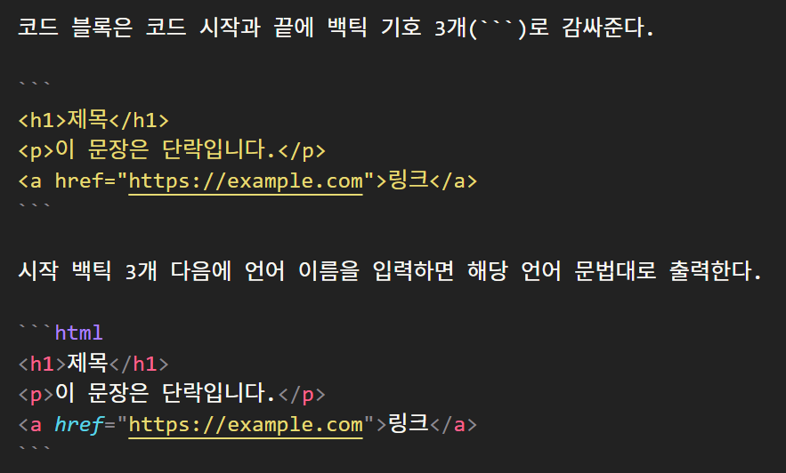

# 마크다운 문법

마크다운 언어는 마크업 언어의 한 종류이며, 마크업 언어란 태그로 문서의 구조나 의미를 표시하는 언어로 웹 문서의 뼈대를 만드는 데 쓰인다.

###### 🔽 마크업 언어 예시 : html, xml, markdown

```html
html - 웹 페이지 작성에 사용

<h1>제목</h1>
<p>이 문장은 단락입니다.</p>
<a href="https://example.com">링크</a>
```

```xml
xml - 데이터 구조 정의 및 교환용

<book>
  <title>책 제목</title>
  <author>작가 이름</author>
</book>
```

```markdown
markdown - 문서 작성용 경량 마크업

# 제목

## 소제목

- 리스트 항목 1
- 리스트 항목 2
```

<br><br>

## 마크다운 언어란 ?

`# 제목, **굵게**, - 리스트` 같이 기호를 사용하여 텍스트에 서식을 추가할 수 있는 약속이며, 비교적 간단히 작성 가능하고 간결하고 직관적인 구조로 문서를 보여준다.
복잡한 도구 없이 기호로 제목, 강조, 목록, 링크, 이미지 삽입 등 다양한 서식을 적용할 수 있다.
텍스트로 저장되기 때문에 용량이 적은 것이 특징이다.
옵시디언, GitHub, chatGPT, 노션, 컨플루언스 등 많은 앱에서 마크다운을 지원한다. 많은 앱에서 사용하는 만큼 이식성이 좋으며, HTML이나 PDF 등 다른 파일로 변환도 쉬우며, .md, .markdown 확장자를 갖는다.

<br><br>

## 마크다운 문법

1. ### **제목 서식**

- `# 제목`
- '#' 을 쓰고 띄어써서 텍스트를 입력한다.
- #이 많을 수록 글자 크기는 작아진다
- 6단계 크기를 지원한다.

# # 제목

## ## 제목

### ### 제목

#### #### 제목

##### ##### 제목

###### ###### 제목

<br>

2. ### **텍스트 서식**

| 서식                                            | 출력                                          |
| ----------------------------------------------- | --------------------------------------------- |
| `**굵게 쓰기**`                                 | **굵게 쓰기**                                 |
| `*기울여 쓰기*`                                 | _기울여 쓰기_                                 |
| `~~취소선 넣기~~`                               | ~~취소선 넣기~~                               |
| `<u>밑줄 넣기</u>`처럼 html을 사용할 수도 있다. | <u>밑줄 넣기</u>처럼 html을 사용할 수도 있다. |

<br>

3. ### **인용문 서식**
   기호 `>`를 쓰고 띄어 쓴 후 인용할 텍스트를 쓰면 인용문 서식이 적용된다

> 미래를 예측하는 가장 훌륭한 방법은 바로 직접 미래를 만드는 것이다.  
> The best way to predict the future is to create it.

<br>

4. ### **리스트 서식**

- **일반 리스트**는 앞에 `-`, `+` 또는 `*`을 붙이고 띄어 쓰기 한 후 텍스트를 입력하면 된다.

```markdown
- **일반 리스트**는 앞에 `-`, `+` 또는 `*`을 붙이고 띄어 쓰기 한 후 텍스트를 입력하면 된다.
```

1. **숫자 리스트**는 앞에 `1.`과 같이 숫자와 온점을 입력 후 한번 띄어 쓰고 텍스트를 입력하면 된다.
1. 다만, 숫자 리스트는 어떠한 숫자를 넣더라도 순서대로 입력이 된다.
1. 예를 들어, `1. > 1. > 2.` 처럼 리스트 숫자가 중복되거나,
1. `1. > 7. > 3.`처럼 순서에 맞지 않더라도 맨 처음 숫자 기준으로 이어지게 자동으로 입력된다.
1. 만약 `5. > 1. > 9.`로 입력되었다면 처음 숫자 `5.`를 기준으로`5. > 6. > 7.`로 입력된다.

```markdown
361. **숫자 리스트**는 앞에 `1.`과 같이 숫자와 온점을 입력 후 한번 띄어 쓰고 텍스트를 입력하면 된다.
362. 다만, 숫자 리스트는 어떠한 숫자를 넣더라도 순서대로 입력이 된다.
363. 보이는 것 처럼 맨 처음 리스트의 숫자를 시작점으로 자동 배열 된다.
```

- [ ] **태스크 리스트**는 텍스트 앞에 체크박스가 있는 형태의 리스트이다.
- [ ] 서식은 `- [ ]`이며, 서식 입력 후 한칸 띄우고 문자열을 입력한다.
- [ ] `-`입력 후 한칸 띄우고 `[ ]`를 입력 했는가 ?
- [ ] 입력한 `[ ]`안에도 한칸 띄웠는가 ?
- [ ] 텍스트 입력하기 전에 `- [ ]` 뒤에서 한칸 띄웠는가 ?
- [x] 완료 항목 서식은 `- [x]` 이다.

```markdown
- [ ] **태스크 리스트**서식에는 모든 기호 입력시 띄어쓰기가 한번 씩 들어간다.
- [ ] **태스크 리스트**서식은 VScode 프리뷰모드에선 구현되지 않는다.
- [x] 완료 항목 서식은 `- [x]` 이다.
```

<br>

5. ### **구분선 서식**
   `---`입력하면 구간을 나눌 수 있는 구분선이 생긴다.

---

<br>

6. ### **코드 블록 서식**

   일반 문자열 사이에 짧게 넣을 경우엔 백틱 기호로 감싸준다.  
    줄 사이의 공백이 필요할 경우 html의 `<br>`이나 `<p>`을 사용하였다.  
    ``줄 사이의 공백이 필요할 경우 html의 `<br>`이나 `<p>`을 사용하였다.``

   코드 블록은 코드 시작과 끝에 백틱 기호 3개(```)로 감싸준다.

   ```
   <h1>제목</h1>
   <p>이 문장은 단락입니다.</p>
   <a href="https://example.com">링크</a>
   ```

   시작 백틱 3개 다음에 언어 이름을 입력하면 해당 언어 문법대로 출력한다.

   ```html
   <h1>제목</h1>
   <p>이 문장은 단락입니다.</p>
   <a href="https://example.com">링크</a>
   ```

   <br>

7. ### **이미지 추가**

   ``  
   ⬇️  
   ``  
   ⬇️  
   

   <br>

8. ### **표 만들기**

|기호로 열 구분, -기호로 행 구분을 하여 표를 만들고, 표 안에서도 텍스트 서식 사용이 된다.

###### 기본

| 제목A | 제목B |
| :---: | :---: |
| 내용1 | 내용2 |
| 내용4 | 내용4 |

###### 서식 사용

|   제목A   |    제목B     |
| :-------: | :----------: |
|  _내용1_  |  **내용2**   |
| ~~내용4~~ | <u>내용4</u> |

```
###### 기본

|제목A|제목B|
|:--:|:--:|
|내용1|내용2|
|내용4|내용4|

###### 서식 사용
|제목A|제목B|
|:--:|:--:|
|*내용1*|**내용2**|
|~~내용4~~|<u>내용4</u>|
```

9. 각주 달기 [^각주]

[^각주]: 이게 될까요 여기서도 ?
