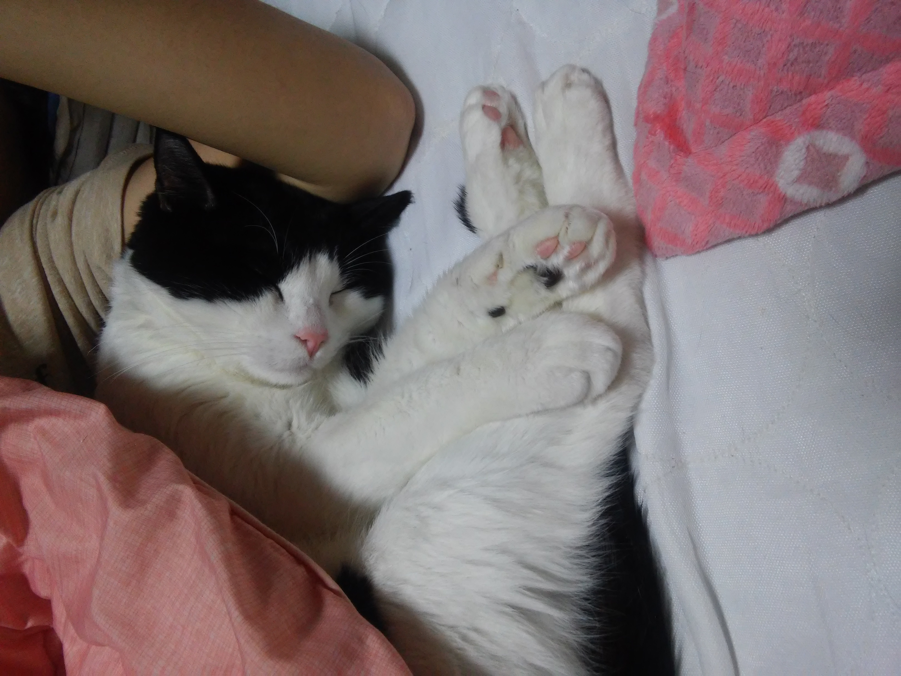

# 네 번째 회고

## 4주차 시간이 그 어느때보다 빠르다🌠

###### 2025-12-08 ~ 2525-12-13

벌써 4주가 흘렀다니. 슬비쌤과 함께하는 수업에서는 마지막 회고이다.
시간이 엄청 빠르게 간다 생각했다가도 노트 필기 한걸 보고 있으면 또 한편으로는 이걸 4주 내에 다 배웠다니... 하는 생각 또한 든다.
이번주는 내 집중력이 내맘같지 않았다. 필기하다 놓치는 순간이 과반수였고...
그러면 그냥 두 손 놓고 선생님의 화면을 바라보고 있어야 했다.
그리고 비어있는 내 필기공간은 선생님의 마크업을 복사 붙여넣기 한 데에 그쳤다.
조금 허탈하고 그래도 노트 한 부분이라도 조금 읽어보자 하고 쉬는 시간에 훑어보면 이거 오늘도 파워복습이 불가피하다 라고 느꼈다.
드문드문 선생님의 마크업을 짚어가며 혼자 해보다가 정 모르는 부분이 있으면 조원분들이나 함께 스터디 하는 분들에게 여쭤보기도 했다.
그럼 정말 기대 이상으로 큰 도움이 되었다.
함께 같은 수업을 듣고 가는지라 어떤 포인트를 알려줘야 하는지 AI보다 훠얼씬 잘 알고계셨다.
나는 정리 정돈을 잘 못하고 그냥 무지성으로 하는 스타일인데, 함께 공부하는 동기분들은 딱 키포인트만 잘 짚어주신다.
삼천포로 잠시 새자면, 얼마전에 김연경 선수가 말하기를 좀 올드한 감독님들은 무조건 몸으로 부딪쳐서 몸이 익히게 하는데
김연경 선수는 그게 싫었다고 한다. 본인은 머리로 알고 움직이는게 더 효과적이었다고 하면서, 감독하면서도 그런식으로 한다고 했다.
이 말 그대로 한 것 같진 않은데 대충 이런 내용이었다...
다른 분들이 알려주시는 거랑 내가 아는 거랑 비교해보면 딱 그 짝이다 내가 그 올드한 감독 스타일이다 하하
항상 약간 벙찐 상태로 노트한 걸 제대로 된 정리도 없이 들입다 읽는다.
처음 배우는 상태라 다 중요한 것 같이 느껴지니 아무래도 이번 수업 내내 계속 이러지 않을까 싶다.
근데 전 기수 수업을 들은 친구가 자기가 한 노트를 보여주는데 야무샘 수업때는 아무것도 받아적을 수가 없었다며
텅 빈 노트를 보여주었다.

이번주는 그래도 복습이 밀리는 한이 있더라도 건너뛰지 말고 해보자 하는 생각이었다.
그래서 아직 3일 전 수업 들은걸 아직도 붙잡고 있다... 체크박스 하나 만드는게 이렇게 복잡할 줄이야.
머리로 다 이해한 줄 알았던 것도 직접 해보지 않으면 어디서 부터 어떻게 손을 대야 할 지를 모른다.
오늘 과제할 때도 분명 픽셀 밀도에 따른 이미지 적용에 관한 내용을 되게 자세하게 정리는 해놨는데
실제로 적용시키려니 HTML로 해야하는지 CSS로 해야하는지... 부터 막히기 시작했다.
그래도 실제로 하나씩 해보니까 이론이 더 쉽게 이해되는 기분이다...!

저번주에는 굉장히 머리도 힘들고 마음도 힘들었는데 그래도 이번주는 좀 덜 했던 것 같다.
소소한 즐거움도 약간씩 있었다. UI 컴포넌트 부분이 꽤 중요해 보이고 어렵기도 해서 며칠씩이나 잡고 있긴 한데,
도저히 안 돼서 막히던 부분이 다음날에는 손쉽게 해결될 때는 기분이 너무 좋았다...!
그리고 드디어 grid라는 것을 배웠다, 아직까지는 친절한 것 같다.
position이랑 flex가 너무 어려웠는데, 주변에서 다들 grid가 진짜 머리 아프다고 하길래 긴장을 좀 많이 했었다.
모든 코드가 다 그렇듯 그들만의 규칙들을 가지고 있는데 내가 다 알지 못하니 더 어렵게 느껴지는 거 같다.
모든 경우를 다 해볼 수도 없고 말이다...
그래도 이번 과제는 다 끝냈다...!
아직 중첩과 상속, 선택자 같은 개념들이 익숙하지 않아서 깔끔하게 만들어지지도 않았고,
뭔가 컴포넌트를 구분짓는 과정에서 좀 잘못한 거 같긴 하지만...
그래도 배운거 하나하나 적용해서 리액션을 보니 기분이 너무 좋다...!

사실 한편으로는 스스로 할 수 있는게 하나도 없고 AI한테 물어도 이해도 안가고 해서...
좀 재미를 잃어가던 차였다. (어디 감히 재미를 느끼려고 하였느냐)
그치만 이렇게 정말 사소한 거지만 조금씩 뭔가 되어간다는 느낌을 받으니 기분이 좋다...
기분도 좋고 이것도 해볼까? 저것도 해볼까? 생각보다 간단히 되네! 하니까 즐겁습니다...
이번 과제는 선생님 께서 보여주신 결과물 보고, 사진 위에 글자 배치 까지나 할 수 있으려나 싶었는데...
이것 또한 grid가 초심자에게 건넨 친절같이 느껴진다.
그리고 픽셀 밀도 별로 1x, 2x 이미지 다르게 적용 시키는 것도 공부할 때는 너어무 어려웠는데
실제로 해보니 적용 시키는 것은 또 비교적 간단했다.
'나 할 수 있는거 하나 더 늘었다.. 근데 이거 왜 이렇게 하는지도 알아'
하는 뿌듯한 마음이 들었다.

수업과 별개로 하는 디제이나 스터디, 챌린지가 억지로라도 머리를 환기시키는데 도움이 되는 것 같다.
원래는 절대절대절대 이런 수업 외 활동을 하지 않는데 갑자기 무슨 바람인지 모르겠다.
대학 시절에도 동아리 하나 들지 않았었는데 말이다...
특히 노션을 제대로 써본 적이 없어서 걱정을 좀 했는데 조원분이 도와주셔서 수월하게 하고 있다!
노션 꾸미는 것도 재밌어서 얼른 웹사이트도 만들어보고 싶다...!
말이 나와서 조심스레 읊어보자면... 처음에 생각한 건 사이버 반려동물 봉안당 같은거였다.
큰언니랑 함께 오랜 세월 함께한 고양이가 얼마 전에 고양이 별로 떠났다.
20년을 함께 살아서 큰언니도 작은언니도 나도, 2년 정도 임보해 준 형부도 눈이 질 정도로 울었다.
반려동물의 장례식은 함께한 사람의 슬픔이 무색하게 몇시간 안에 금방 끝난다.
장례식이 끝나면 남는 거라곤 무수히 많은 사진과 영상과 다 하지 못한 말들과 다 주지 못한 애정과 간식과 사료 등등...이다
그들만을 위한 기억하고 추모할 공간이 있으면 좋을 것 같다고 생각했다.
그래서 내가 꼭 만들어 보고 싶다..! 반려동물을 떠나보낸 사람들이 다 함께 모이는 곳이면 좋겠지만,
서버구축이 어렵다면 언니만을 위해서라도 꼭 만들고 싶다.

아무튼...! 4주가 너무 짧게 느껴지지만 정말 많이 배웠다.
많은걸 알려주셨으니 이걸 더 깊게 파고들고 제대로 체득하는건 오롯이 내 몫이다!
너무 좌절하지도 말고 너무 들뜨지도 말고 정신 단디 붙잡고, **꾸준히 침착하게!**

---

> _선생님께서도 4주간 정말 고생 많으셨습니다! 하루도 빠짐 없이 꼼꼼한 수업은 놀라움의 연속이었어요!
> 앞으로 나아가는데 제대로된 방향과 마음가짐을 잘 알려주셔서 너무 감사합니다!_
